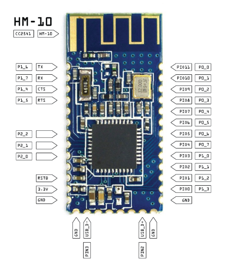
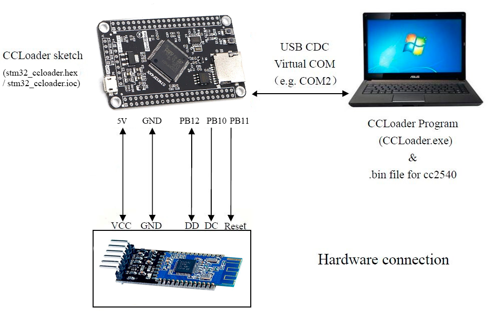

This repository was created to flash the HM10 CC254x bluetooth module using the STM32 microcontroller.
Programming was carried out in the STM32CubeIDE application based on the STM32F407T6 microcontroller.
To flash, please follow steps:
1. Download the project folder  [`stm32_ccloader`](/stm32_ccloader) and open it in the STM32CubeIDE program.
You can also download the [stm32_ccloader.hex](https://github.com/fawntio/CCLoader_STM32/releases) binary file and open it with ST-LINK Utility. Flash firmware to your microcontroller.
2. Connect the pins of the controller and the bluetooth module as shown in the picture:

 Pin Name | Microcontroller Pin# | HM10 Pin# |
| --- | --- | --- | 
| DD (DEBUG_DATA) | PB12 | Pin#8 | 
| DC (DEBUG_CLOCK) | PB10 | Pin#7 | 
| Reset (RESET_N)| PB11 | Pin#11 |
| VCC | 3.3V |  Pin#12 | 
| GND | GND | Pin#13 | 

3. Run the program [CCLoader.exe](https://github.com/fawntio/CCLoader_STM32/releases/CCLoader.exe) to load the [Demo.bin](https://github.com/fawntio/CCLoader_STM32/releases/CCLoader.exe) in the terminal.

